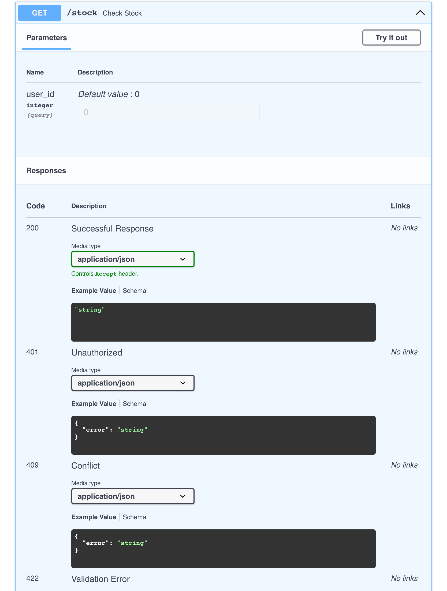

## FastAPI Error Map

[](https://badge.fury.io/py/fastapi-error-map)

[](https://codecov.io/gh/ivan-borovets/fastapi-error-map)


Elegant per-endpoint error handling for FastAPI that keeps OpenAPI in sync.

### 📦 Installation

```bash
pip install fastapi-error-map
```

### 🚀 Quickstart

```python
# A seamless replacement for APIRouter with error mapping support
router = ErrorAwareRouter()


@router.get(
    "/stock",
    error_map={
        # Minimal rule: return 401 and respond with {"error": "..."}
        # using default translator
        AuthorizationError: 401,
        # Full rule: return 409 and respond with custom JSON
        # using custom translator, and trigger side effect
        OutOfStockError: rule(
            status=409,
            translator=OutOfStockTranslator(),
            on_error=notify,
        ),
    },
)
def check_stock(user_id: int = 0) -> None:
    if user_id == 0:
        raise AuthorizationError
    raise OutOfStockError("No items available.")

```

- Fully compatible with `APIRouter`
- Error handling centralized at the endpoint level
- OpenAPI schema automatically generated

<div align="center">
  
  <p><em>Figure 1: Example OpenAPI</em></p>
</div>

### 🔍 Why Not Global Handlers?

To convert application errors into HTTP responses, FastAPI allows attaching exception handlers to the app instance.
These handlers are global, which makes it harder to customize the response based on context and can become a source of
hidden bugs.

```python
app.add_exception_handler(UserNotFoundError, error_handler)

```

For example, `error_handler` might turn `UserNotFoundError` into `404 Not Found`.
But in an authentication context, it might mean `401 Unauthorized`, and in a communication scenario —
`422 Unprocessable Entity`.
The fact that a user is missing carries different meaning in different situations.

If accuracy and clarity in your API matter more than the short-term convenience of global (and implicit) exception
interception, prefer handling exceptions directly in the route — where full context is available: request type, business
scenario, and client expectations.

You could use `try/except` blocks or a decorator with error mapping.
The first doesn't keep your views clean and duplicates logic between routes.
The second solves that, but like the first, remains invisible to FastAPI: the framework can't extract possible responses
from your decorator to include in the OpenAPI schema.
You could define `responses` manually, but that risks a mismatch between the schema and actual behavior — because
there's no single source of truth.

`fastapi-error-map` solves this by letting you define error handling rules right in the route declaration.
See the [example in the 🚀 Quickstart](#-quickstart).

### ⚙ Using `error_map`

Error handling rules are defined directly in the route declaration of an `ErrorAwareRouter`, using the `error_map`
parameter.

There are two ways to do it:

#### 🔸 Short Form

```python
error_map = {
    SomeError: 400,
}

```

Which is equivalent to:

```python
error_map = {
    SomeError: rule(status=400),
}

```

In both cases, the default translator is used, which returns JSON like:

```json
{
  "error": "..."
}
```

#### 🔹 Full Form

Allows you to specify the status code, and optionally a `translator` and `on_error`:

```python
error_map = {
    MyError: rule(
        status=409,
        translator=MyTranslator(),
        on_error=report_to_sentry,
    ),
}

```

Parameters of `rule(...)`, * — required:

- `status`* — HTTP status code to return (e.g. `404`, `409`, `422`)
- `translator` — object that converts an exception into JSON response. If not provided, the default one is used (returns
  `{ "error": "..." }`)
- `on_error` — function to call when an exception occurs (e.g. logging or alerting)

#### 🧩 Matching semantics

`error_map` matches **exact** exception types only (no inheritance).
If you map `BaseError` and raise `ChildError(BaseError)`, the rule won’t apply.
This is by design to keep routing explicit.
If there’s demand, inheritance-based resolving may be added later as an opt-in.

### 🧰 Custom Translators

If you want to change the error response format, define your own `translator` — object that implements `ErrorTranslator`
protocol.
It has:

- `.from_error(err)` — turns exception into serializable object
- `.error_response_model_cls` — returns a class describing object structure (used for OpenAPI)

Example:

```python
from dataclasses import dataclass
from fastapi_error_map.translators import ErrorTranslator


@dataclass
class MyErrorResponse:
    type: str
    message: str


class MyTranslator(ErrorTranslator[MyErrorResponse]):
    @property
    def error_response_model_cls(self) -> type[MyErrorResponse]:
        return MyErrorResponse

    def from_error(self, err: Exception) -> MyErrorResponse:
        return MyErrorResponse(
            type=type(err).__name__,
            message=str(err),
        )

```

#### ⚠️ Translator robustness

Custom translators should not raise exceptions.
If `from_error(...)` fails at runtime, the exception will propagate to FastAPI’s global handlers.

### 🔄 Side Effects (`on_error`)

The `on_error` parameter in `rule(...)` allows specifying function to run when exception occurs, before response is
generated.
It doesn’t change the response status/body when it succeeds and is useful for:

- logging
- sending alerts
- metrics
- debugging

Example:

```python
def notify_admin(err: Exception) -> None:
    print(f"[!] Error: {type(err).__name__} — {err}")


error_map = {
    DangerousOperationError: rule(
        status=500,
        translator=MyTranslator(),
        on_error=notify_admin,
    ),
}

```

#### 🚨 Strict side effects

`on_error` is executed before the response is generated.
If it raises, the exception propagates and the request fails.
This is intentional to avoid hiding errors in side effects — they should be fixed rather than silently ignored.
Keep `on_error` robust or wrap it on your side if you prefer soft-fail logging.

> [!NOTE]
> Both translator and `on_error` receive the raised exception as an argument.
> If your implementation does not use it, suppress the unused-argument warning from your linter (e.g. `# noqa: ARG002`
> for Ruff).

### 🧠 Parameter Precedence

Error handling and schema generation in `fastapi-error-map` are fully driven by route-level arguments to `.get()`,
`.post()`, etc.

#### 📎 Core Parameters

In addition to `error_map`, you can also pass:

```
@router.get(
    "/path",
    error_map=...,
    default_on_error=...,
    warn_on_unmapped=...,
    default_client_error_translator=...,
    default_server_error_translator=...,
)
```

These parameters apply to the current route only.
They are not set on the router level (for now).

#### ➕ How Parameters Are Resolved

When an error occurs, `fastapi-error-map` processes it as follows:

1. `status` is taken from `rule(...)`, or from short form: `SomeError: 400`
2. `translator`:

- If provided in `rule(...)`, it is used
- Otherwise:
    - If the status is `< 500`, `default_client_error_translator` is used (if given)
    - If the status is `>= 500`, `default_server_error_translator` is used (if given)
    - If none are set, the built-in one is used:
  ```raw
  { "error": "..." } or { "error": "Internal server error" }
  ```

3. `on_error`:
    - If provided in `rule(...)`, it is used
    - Otherwise, `default_on_error` is used if provided
    - If neither is set, nothing is called

#### 🧾 OpenAPI: `responses` Takes Priority

If you explicitly pass the `responses=...` parameter to `.get(...)` / `.post(...)`, it overrides the schema generation
from `error_map` — but only for the specified status codes.

```python
@router.get(
    "/foo",
    error_map={SomeError: 400},
    responses={400: {"model": {}}},  # ← this wins
)

```

#### ❗ Handling Unmapped Exceptions (`warn_on_unmapped`)

By default (`warn_on_unmapped=True`), `fastapi-error-map` expects every exception raised in a handler to be explicitly
listed in `error_map`.  
If a rule is missing, a `RuntimeError` is raised, and the original exception is attached as `__cause__`.
This helps you catch missing error cases at runtime.

If you set `warn_on_unmapped=False`, the library won’t complain about missing rules and will re-raise the exception
as-is.
In that case:

- the exception type is preserved
- the original stack trace is retained
- the global `@app.exception_handler(...)` in FastAPI will receive raw exception

#### 📘 Handling by FastAPI

FastAPI will always catch unhandled exceptions and pass them to the global `@app.exception_handler(...)` if defined.
This behavior is not affected by `warn_on_unmapped`.

If the error is declared in `error_map`, `fastapi-error-map` handles the response itself — the global handler will not
be triggered.

### 📚 Examples

- Minimal usage: [`examples/`](./examples/main.py)
- More advanced usage: [Clean Architecture example app](https://github.com/ivan-borovets/fastapi-clean-example)
